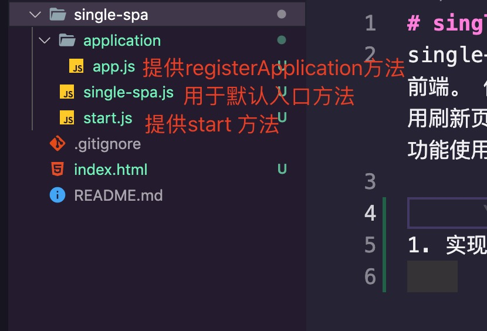
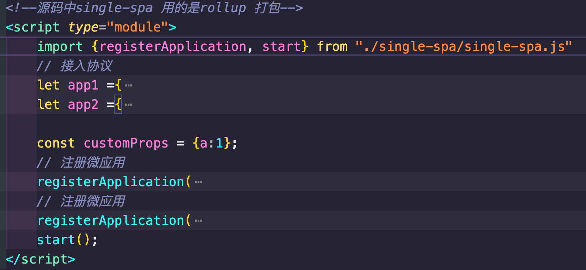
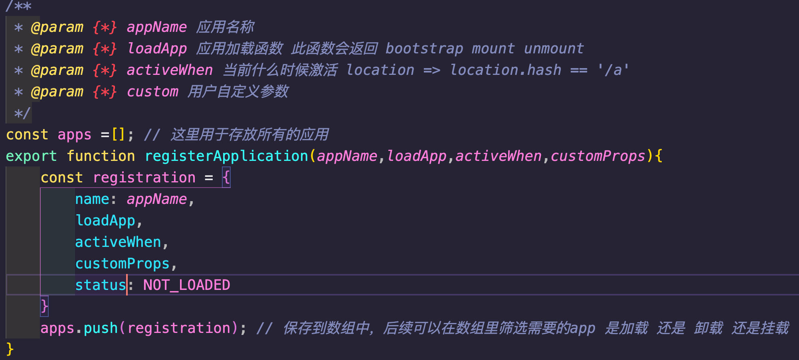
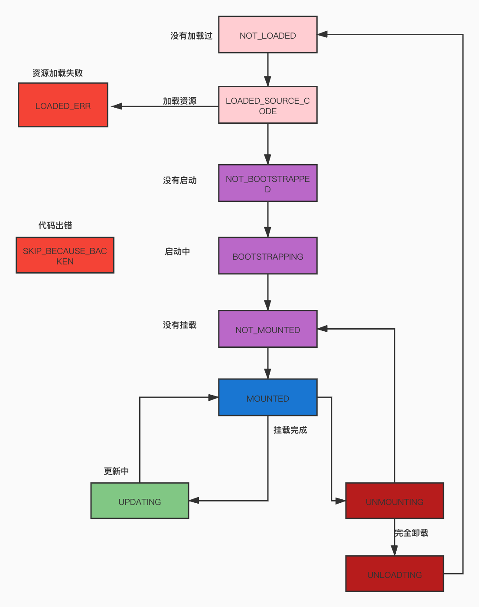

# single-spa-code
single-spa-code 源码实现   Single-spa 是一个多单页面应用聚合为一个整体应用的 JavaScript 微前端前端。 使用 single-spa 进行前端架构设计可以带来很多好处，例如：  在同一页面上使用了多个前端框架 而不用刷新页面 （React、AngularJS、Angular、Ember、你正在使用的框架） 独立部署每一个单页面应用程序 新功能使用新框架，旧的单页应用无需更新可以共存 优化初始加载时间，慢加载代码

# 一. 实现single-spa 
> ### 目录规划
 

> ### 通过ES6 Module 引入 single-spa
 

## 1. 实现 registerApplication
 

## 2 应用加载状态
状态机
 

